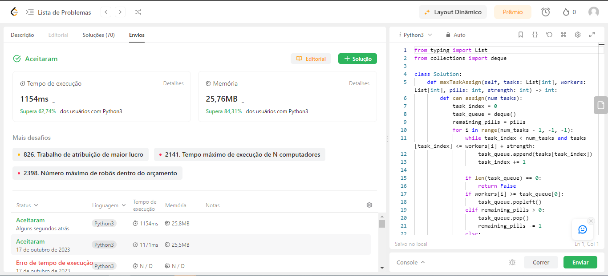
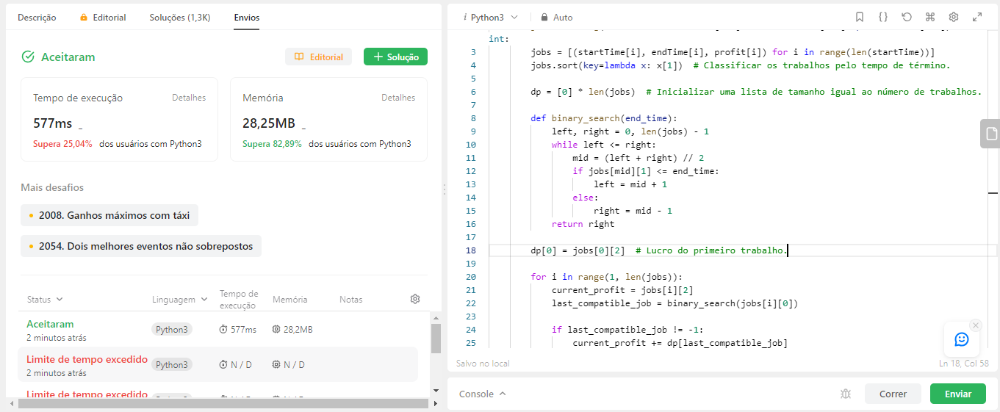
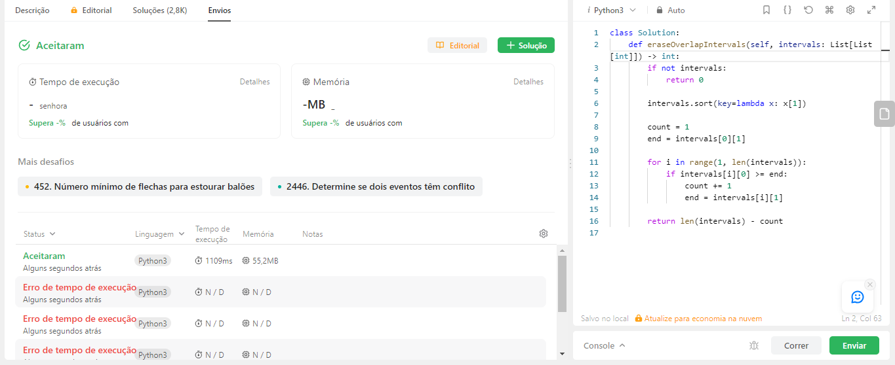
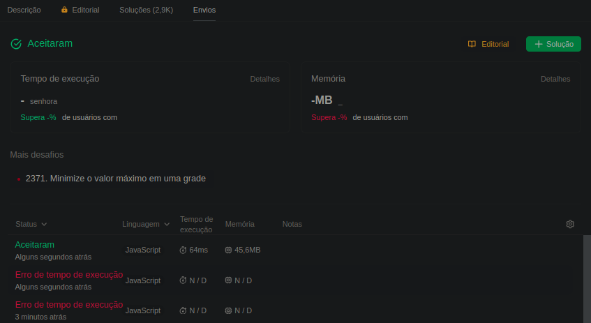
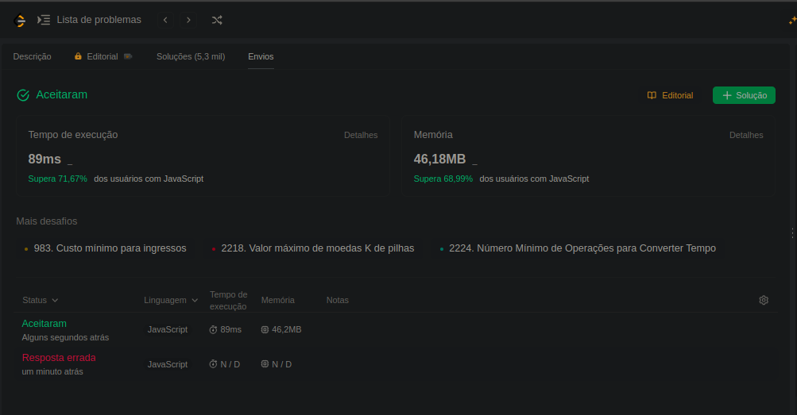
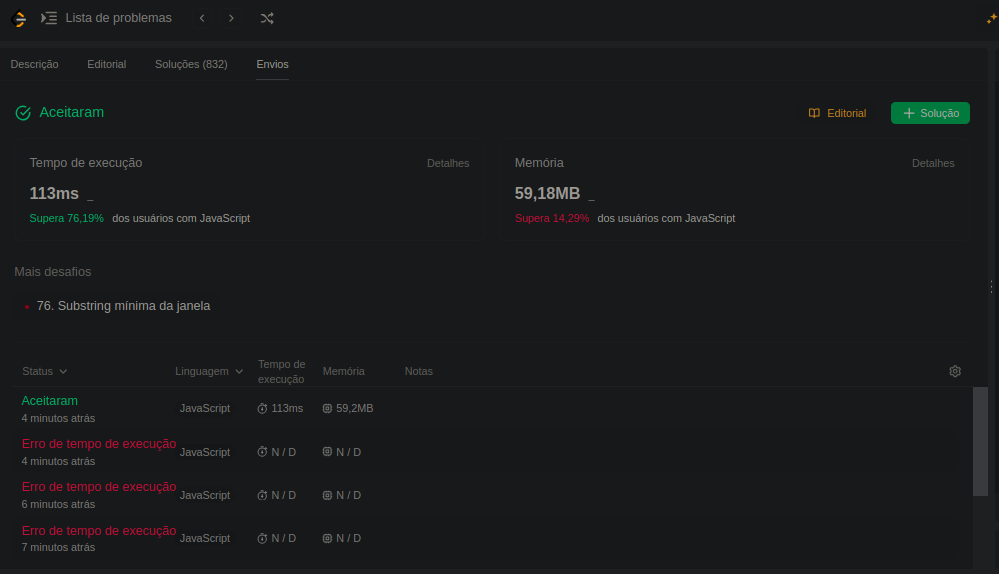

# Exércicios resolvidos - Algoritimos Ambiciosos

**Número da Lista**: 3 
**Dupla**: 5  
**Conteúdo da Disciplina**: Algoritmos Ambiciosos 

## Alunos
|Matrícula | Aluno |
| -- | -- |
| 19/0033681  | Luiz Henrique Fernandes Zamprogno |
| 20/2016767  | Lucas Felipe Soares |

## Sobre 

A aplicação dos conceitos de **Algoritmos Ambicioso** aprendidos na disciplina de Projeto de Algoritmos da disciplina foi realizada por meio da realização de X exercícios sobre o assunto. Exercícios Executados:

### Exércicios executados

| Exercício | Dificuldade | Id Leetcode | Linguagem | Código |
| -- | -- | -- | -- | -- |
| [2071 - Número máximo de tarefas que você pode atribuir](link) | Dificil | [2071](https://leetcode.com/problems/maximum-number-of-tasks-you-can-assign/description/) | Python3 | [2071-MaximoTarefasAtribuir.py](https://github.com/lucasfs1007/Grafos1_ExerciciosResolvidos/blob/master/2071-MaximoTarefasAtribuir.py) |
| [1235 - Lucro Máximo no Agendamento de Trabalho](link) | Dificil | [1235](https://leetcode.com/problems/maximum-profit-in-job-scheduling/description/) | Python3 | [1235-LucroMaximoAgendamentoTrabalhor.py](https://github.com/lucasfs1007/Grafos1_ExerciciosResolvidos/blob/master/1235-LucroMaximoAgendamentoTrabalhor.py) |
| [435 - Intervalos não sobrepostos](link)| Difiicil | [435](https://leetcode.com/problems/non-overlapping-intervals/description/) | Python3 |[435-IntervalosNaoSobrepostos.py](https://github.com/projeto-de-algoritmos/AlgoritmosAmbiciosos_ExerciciosResolvidos/blob/master/435-IntervalosNaoSobrepostos.py) |
| [135 - Doces](https://github.com/projeto-de-algoritmos/AlgoritmosAmbiciosos_ExerciciosResolvidos/blob/master/135-doce.pdf) | Dificil | [135](https://leetcode.com/problems/candy/description/) | JavaScricpt| [135-doces.js](https://github.com/projeto-de-algoritmos/AlgoritmosAmbiciosos_ExerciciosResolvidos/blob/master/135-doces.js) |
| [322 - Mudança de Moeda](https://github.com/projeto-de-algoritmos/AlgoritmosAmbiciosos_ExerciciosResolvidos/blob/master/322-mudancaMoeda.pdf) | Médio | [322](https://leetcode.com/problems/coin-change/description/) | JavaScricpt| [322-mudancaMoeda.js](https://github.com/projeto-de-algoritmos/AlgoritmosAmbiciosos_ExerciciosResolvidos/blob/master/322-mudancaMoeda.js) |
| [632 - Menores elementos de cobertura de intervalo das listas K](https://github.com/projeto-de-algoritmos/AlgoritmosAmbiciosos_ExerciciosResolvidos/blob/master/632-menoresElementosLista.pdf) | Dificil| [632](https://leetcode.com/problems/smallest-range-covering-elements-from-k-lists/description/) | JavaScricpt| [632-MenorLista.js](https://github.com/projeto-de-algoritmos/AlgoritmosAmbiciosos_ExerciciosResolvidos/blob/master/632MenorLista.js) |

## Video

[Video](https://youtu.be/)

## Screenshots

### 2071 - Número máximo de tarefas que você pode atribuir

### 1235 - Lucro Máximo no Agendamento de Trabalho

### 435 - Intervalos não sobrepostos

### 135 - Doces

### 322 - Mudança de Moeda

### 632 - Menores elementos de cobertura de intervalo das listas K

## Instalação 

Não é necessario instalação, os exercicios devem ser rodados no site [leetcode]([link](https://leetcode.com/problemset/all/)).

**Linguagem 1**: Python3 
**Linguagem 2**: Javascript 

## Uso

1. Acesse o site [LeetCode](https://leetcode.com/problemset/all/).

2. Crie uma conta e faça o login.

3. Vá para o link do exercício desejado, que pode ser encontrado na coluna "Id LeetCode" da tabela de exercícios executados.

4. Selecione a linguagem de programação correspondente ao exercício, indicada na coluna "Linguagem" da tabela de exercícios executados.

5. Copie o código correspondente encontrado na coluna "Código" da tabela de exercícios executados.

6. Clique no botão "Enviar" no canto inferior direito e verifique a execução correta do código.

## Outros

As questões foram implementadas em duas linguagens diferentes para explorar a aplicação de conhecimentos em linguagens distintas.

